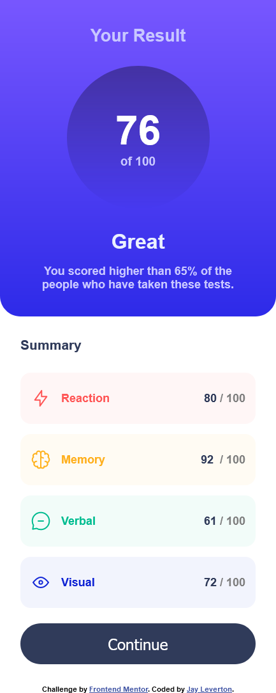
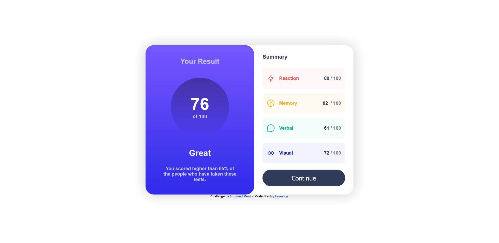

# Frontend Mentor - Results summary component solution

This is a solution to the [Results summary component challenge on Frontend Mentor](https://www.frontendmentor.io/challenges/results-summary-component-CE_K6s0maV). Frontend Mentor challenges help you improve your coding skills by building realistic projects. 

## Table of contents

- [Overview](#overview)
  - [The challenge](#the-challenge)
  - [Screenshot](#screenshot)
- [My process](#my-process)
  - [Built with](#built-with)
  - [What I learned](#what-i-learned)
- [Author](#author)
- [Acknowledgments](#acknowledgments)

## Overview

### The challenge

Users should be able to:

- View the optimal layout for the interface depending on their device's screen size
- See hover and focus states for all interactive elements on the page

### Screenshot




## My process

- I started by getting the main structure outlined with HTML, including labelling classes onto all the containers and elements that I'd need to format with CSS. I tried to keep the classes fairly modular in the interest of reusability.
- I then started transferring all necessary information from the style guide into CSS, such as the font and colours, using custom variables to keep the colours easy to identify and manipulate.
- I started working my way down the page, starting from the top-most elements and containers, working on the elements that would make the largest changes first such as the colours, rounded edges, general shapes, and spacing.
- Then after the mobile version was more or less completed and looking near identical to the design image, I began working on the desktop resolution using a media query. I ran into an issue where, due to the way I had originally styled the width of the content, resizing the width of the browser could cause elements to extend outside the bounds of their containers, specifically the ability rows under the summary. I eventually came to the conclusion that it was due to using ``width: *vw``. After some googling and a peek at how the solution handled the width, I learned of the clamp property, ```width: clamp(700px, 50%, 800px);```. This paired with both removing the margin and using ```justify-content: space-around;```, allowed me to eliminate the resizing issues.
- After the desktop version was almost done, it was easier to compare the design images and my solution, so I began adjusting values and added the active button styling to increase the similarity between my solution and the designs.

### Built with

- Semantic HTML5 markup
- CSS custom properties
- Flexbox
- Mobile-first workflow

### What I learned

- The ```clamp``` property in regards to width allows for minimum and maximum resizing without the responsive extremes that ```vh``` and ```vw``` present.
- It can be better to use ```justify-content: space-around``` as opposed to margins when possible, in order to more efficiently make the page more responsive.
- It can be beneficial to string classes together in order to create reusable and modular styles, e.g. the ```cognitive-row``` classes and the ```*colour*-row``` classes.

## Author

- [Website](https://www.your-site.com)
- [Frontend Mentor](https://www.frontendmentor.io/profile/JayLeverton)
- [LinkedIn](https://www.linkedin.com/in/jay-leverton-5079a7a4/)
- [Twitter](https://www.twitter.com/LevertonJay)

## Acknowledgments

- [A solution I peeked at in order to understand how to style the width without using VW or percentages](https://github.com/AdrianGallano/results-summary-component/blob/main/style.css)
